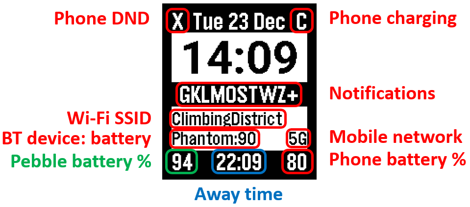

# Pebble

A Pebble watchface including all the features I need.

### Screen size

| Platform       | Screen size |
|----------------|-------------|
| Aplite, Basalt | 144x168     |
| Time 2         | 200x228     |

### Fonts

- Roboto 49
- Gothic 28 Bold
- Gothic 24 Bold
- Gothic 18 Bold

### Display layout

| ID     | Y Pos | Position | Item              | Text         | Font      |
|--------|-------|----------|-------------------|--------------|-----------|
| `date` | -10   | Center   | Date              | `Sun 31 Dec` | Gothic 28 |
| `dnd`  | -10   | Left     | Quiet mode        | `Q`          | Gothic 28 |
| `pchg` | -10   | Right    | Phone charging    | `C`          | Gothic 28 |
| `conn` | 15    | Left     | Connection status | `C`          | Gothic 18 |
| `home` | 16    | Line     | Home time         | `23:39`      | Roboto 49 |
| `noti` | 68    | Center   | Notifications     | `GK+`        | Gothic 28 |
| `btc`  | 96    | Left     | Bluetooth charge  | `90`         | Gothic 24 |
| `btid` | 96    | Line     | Bluetooth ID      | `Bose`       | Gothic 24 |
| `net`  | 117   | Left     | Network           | `4G`         | Gothic 24 |
| `wifi` | 117   | Line     | WiFi              | `SFR_box`    | Gothic 24 |
| `away` | 140   | Center   | Away date/time    | `03:39`      | Gothic 28 |
| `wbat` | 140   | Left     | Watch Battery     | `99`         | Gothic 28 |
| `pbat` | 140   | Right    | Phone Battery     | `99`         | Gothic 28 |

Black background

- (0, 0, 144, 21): `date` and `pchg`

- (0, 72, 144, 26): `noti`

- (0, 147, 144, 22): `away` and `dnd`

# Display items

## Watch state

Date and time is based on the Pebble internal clock, which is synchronized with the phone.
The away time is calculated as a constant offset from the home time,
the offset being defined in hours and minutes (positive or negative).

A one-character code represents the App and PebbleKit connection status.

|               | App OK | App NOK |
|---------------|:------:|:-------:|
| PebbleKit OK  | `C`    | `?`     |
| PebbleKit NOK | `-`    | `X`     |

The watch battery is standard Pebble C SDK.

## Phone state

### Read battery and charging

### Read active Bluetooth device and charge

### Read WiFi SSID

### Read mobile network type

### Read/Write DND

### Play music

Also read/write media volume.

## Notifications

Notifications are intercepted, then the emitting package name is compared to the configuration list.
If a package matches, the corresponding letter (upper case only) is added to the notification string.
Notification removal is also intercepted in order to remove the corresponding letter from the string.
If a package is not found in the list, a `+` is added.
Up to 9 packages can be stored in the list.

Examples

| Letter | App      | Package                             |
|--------|----------|-------------------------------------|
| `G`    | Gmail    | `com.google.android.gm`             |
| `K`    | Kakao    | `com.kakao.talk`                    |
| `L`    | LinkedIn | `com.linkedin.android`              |
| `M`    | Meet     | `com.google.android.apps.tachyon`   |
| `O`    | Outlook  | `com.microsoft.office.outlook`      |
| `S`    | SMS      | `com.google.android.apps.messaging` |
| `T`    | Teams    | `com.microsoft.teams`               |
| `W`    | WhatsApp | `com.whatsapp`                      |
| `Z`    | Zoom     | `us.zoom.videomeetings`             |

# Android app

## Layout

| Item          | Info/Input                                         |
|---------------|----------------------------------------------------|
| Pebble watch  | Connection status                                  |
| Permisison    | Confirm access or link to settings                 |
| Away timezone | Hours, Minutes (+ or -)                            |
| Notifications | (list up to 9) Package name, Letter                |
| Bluetooth     | (list up to 9) Device ID, Mnemonic (up to 5 chars) |

## Permissions

- Notification access

- Bluetooth connections (event)

- WiFi status (event)

- Mobile network type (event)

- Battery and charging (event)

- DND status (event)

# Watch-app

| Button | Function      |
|--------|---------------|
| Up     | Toggle DND    |
| Center | Find my phone |
| Down   |               |

# Communication

## Dictionary keys

| Key | Meaning          | Type     | Note           |
|-----|------------------|----------|----------------|
| 1   | Message type     | Int8     | See below      |
| 2   | Timezone minutes | Int16    | -1439 to +1439 |
| 3   | Phone DND        | Int8     | 0 or 1         |
| 4   | Phone battery %  | Int8     | 0 to 100       |
| 5   | Phone charging   | Int8     | 0 or 1         |
| 6   | Network type     | Int8     | 2, 3, 4, 5 (G) |
| 7   | WiFi SSID        | String   | up to 20 bytes |
| 8   | BT device        | String   | up to 20 bytes |
| 9   | BT battery       | Int8     | 0 to 100       |
| 10  | Notifications    | String   | up to 12 bytes |
| 11  | Action           | Int8     | See below      |
| 12  | Model            | Int8     | Defined in SDK |
| 13  | FW version       | UInt32   | 3 bytes        |

## Message types

| ID | Meaning             | Parameters |
|----|---------------------|------------|
| 1  | Info                | 12, 13     |
| 2  | Timezone            | 2          |
| 3  | Phone DND           | 3          |
| 4  | Phone charge status | 4, 5       |
| 5  | Network type        | 6          |
| 6  | WiFi SSID           | 7          |
| 7  | BT device           | 8, 9       |
| 8  | Notifications       | 10         |
| 9  | Action              | 11         |

## Action types

| ID | Meaning       |
|----|---------------|
| 1  | Find my phone |
| 2  | Toggle DND    |
| 3  | TBD           |
